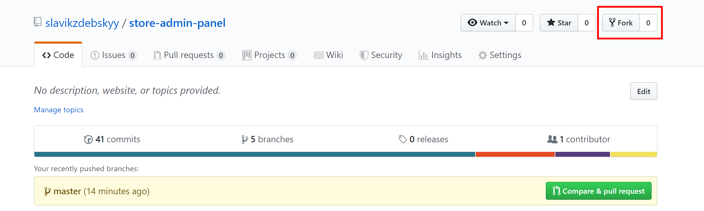
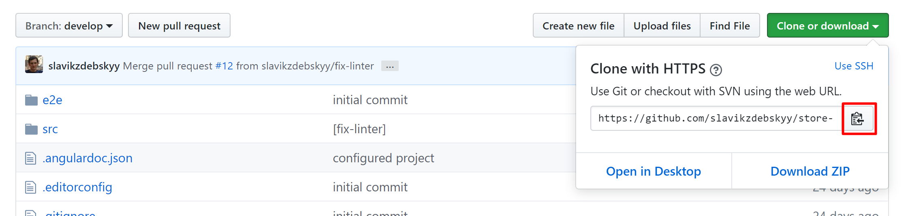

# StoreAdminPanel

## Tech stack:

* Angular
* TypeScript 
* HTML/SCSS

## Contribution process overview

1. Fork this project.
1. Create a feature branch.
1. Make your changes.
1. Run the project locally
1. Run the tests.
1. Push your changes to your fork/branch.
1. Open a pull request.

### 1. Fork

Click the _Fork_ button up top.

Clone your fork locally (Notice that git's `origin` reference will point to your forked repository).

It is useful to have the upstream repository registered as well using: 

    git remote add upstream https://github.com/slavikzdebskyy/store-admin-panel.git

and periodically fetch it using 

    git fetch upstream

### 2. Switch to _develop_ branch

Switch to _develop_ branch: 

    git checkout develop

or

    git checkout -b devlop
    git pull

### 3. Create a feature branch

Create and switch to a new feature branch:  

    git checkout -b {branch_name} upstream/master 

(replace `{branch_name}` with a meaningful name that describes your feature or change).

### 4. Make your changes

Now that you have a new branch you can edit/create/delete files. Use touch-up commits using:

    git commit --amend`

(You may use git force push after that).

### 5. Run the project locally

Install the dependencies: `

    npm install

Start the local development server:

    npm start

### 6. Run the tests

Run tests: 
    
    npm test

Run lint: 
    
    npm run lint

### 7. Push your changes to your fork/branch

After lint and all tests pass, push the changes to your fork/branch on GitHub: 
    
    git push origin {branch_name}
For force push, which will destroy previous commits on the server, use `--force` (or `-f`) option.

### 8. Create a pull request

Create a pull request on GitHub for your feature branch.

